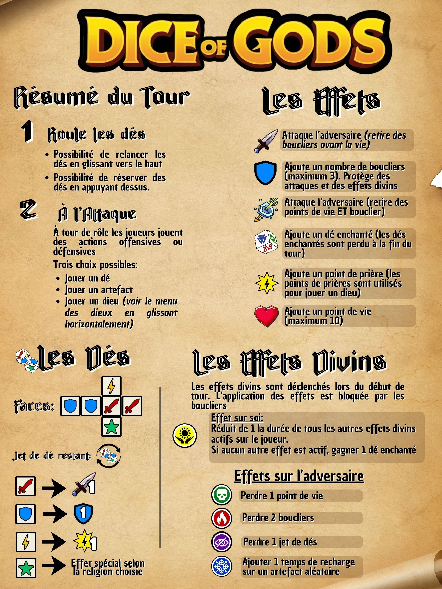
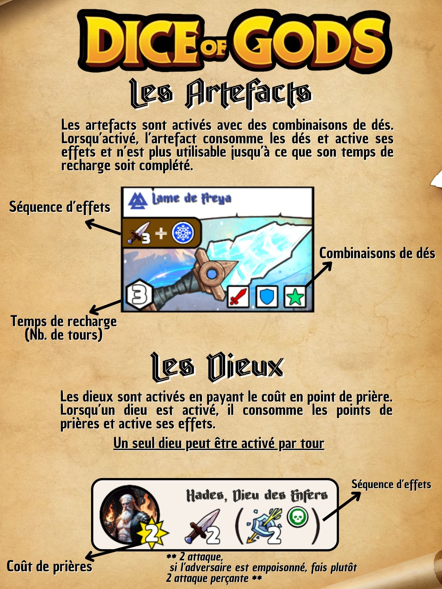

# Dice_of_Gods
Projet Synthèse C61 - Technique de l'informatique - CVM Automne 2025

## Auteurs
- Hugo Beaulieu
- Frédéric Desrosiers

## Sommaire
Dice of Gods est un adaptation du jeu de table du même nom. Conçu par Frédéric Desrosiers en 2023, Dice of Gods est un jeu d'affrontement 1 contre 1. Le jeu est ancré dans la thématique des divinités antiques. L'utilisation de dés et de cartes puissantes font de chaque partie un combat enlevant.

## Pour jouer au démo
Télécharger Expo Go sur le Apple/Google Store.

### Android
Scanner le code avec l'application Expo Go.

### Apple
Scanner le code avec l'application Caméra.

### Code QR

## Règlements du jeu

